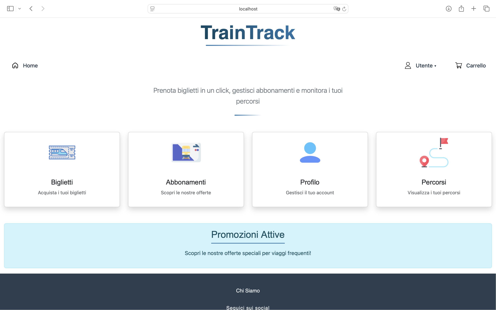
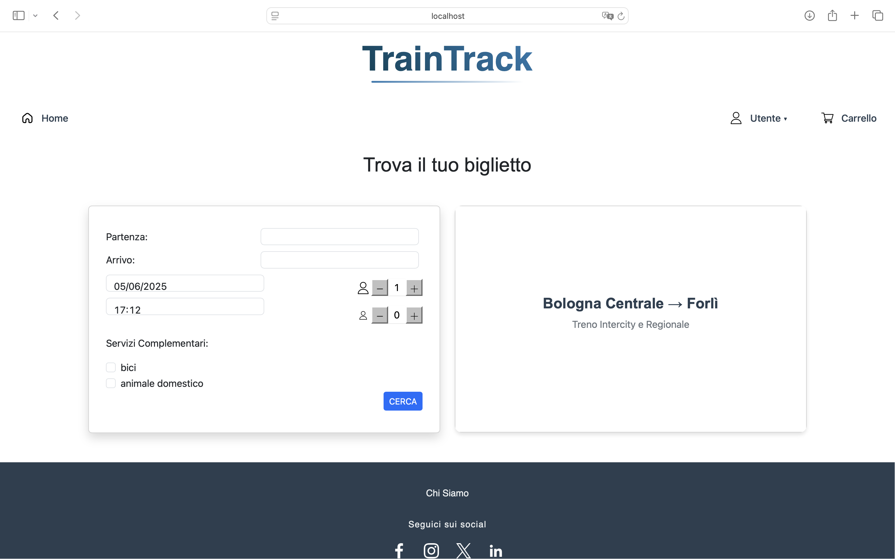
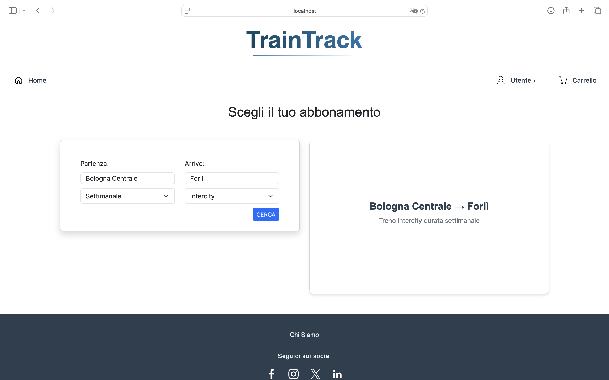
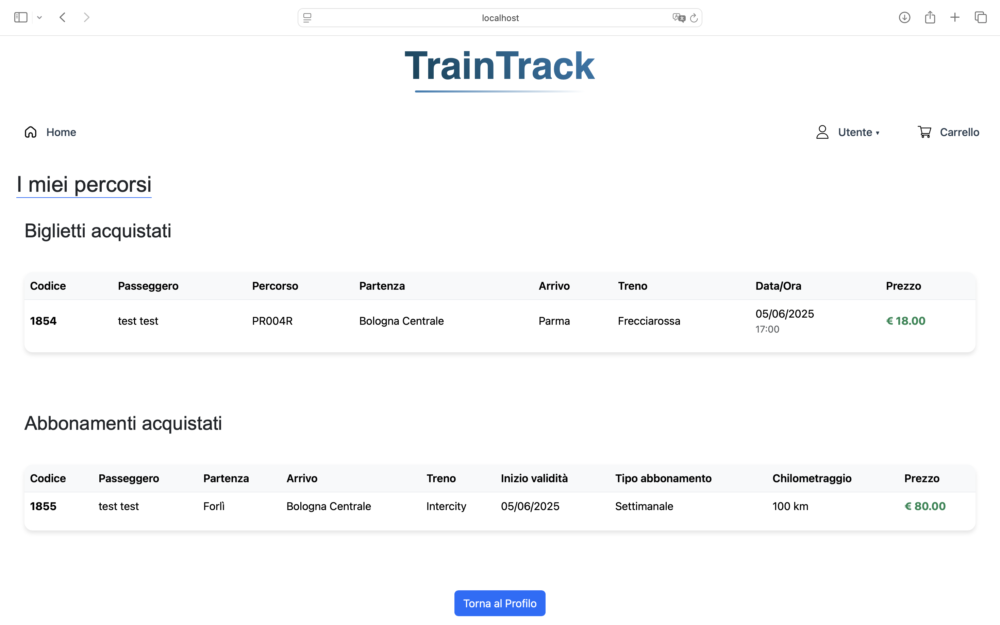

# 🚆 TrainTrack-Web

TrainTrack è un sistema gestionale per percorsi ferroviari, utenti e ordini, sviluppato in PHP, MySQL, JavaScript, CSS e Bootstrap.
Progetto universitario pensato per integrare funzionalità come notifiche, abbonamenti, pagamenti e storico ordini.

## Requisiti

- [XAMPP](https://www.apachefriends.org/) installato (Apache + MySQL)
- Browser web (Chrome o Firefox)
- Editor di testo (Visual Studio Code, Sublime, ecc.)

## Istruzioni per l’avvio

1. **Clona o copia il progetto nella directory di XAMPP:**

   Copia la cartella `TrainTrack-Web` dentro:

   2. **Avvia i servizi Apache e MySQL** da **XAMPP Control Panel**.

3. **Importa il database:**

- Importa il file, creando un nuovo database chiamato traintrack:

  ```
  db/traintrack.sql
  ```

- Poi importa (sullo stesso database) il file per popolare il database:

  ```
  db/populatedb.sql
  ```

4. **Accedi al sito:**

Vai su [http://localhost/TrainTrack-Web/](http://localhost/TrainTrack-Web/) nel browser.

---

## Struttura delle cartelle

```bash
TrainTrack-Web/
│
├── api/                   # Endpoint PHP (es. login, registrazione)
├── css/                   # File CSS personalizzati
├── js/                    # File JavaScript (es. login.js)
├── template/              # Template HTML riutilizzabili
├── db/
│   ├── database.php       # Database Helper 
│   ├── traintrack.sql     # Struttura del database
│   └── populatedb.sql     # Query di popolamento dati
├── login-controller.php   # Login backend
├── register.php           # Pagina di registrazione
├── home.php               # Homepage
├── index.php              # Pagina iniziale
└── ...
```
---

## Anteprima

### Homepage


### Pagina per ricerca biglietti


### Pagina per ricerca abbonamenti


### Pagina di carrello


### Pagina di acquisto


### Pagina di Login


### Profilo Utente


### Pagina di riepilogo ordini di un utente


### Pagina di notifiche


### Pagina di buoni sconto


### Autori
- [@elisayan](https://github.com/elisayan)
- [@amielajunio](https://github.com/amielajunio)
